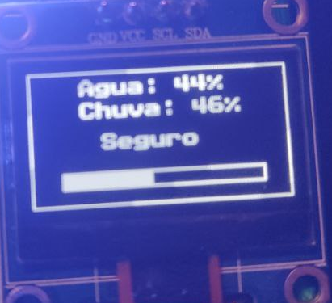

# GuardaChuvas ☔: Estação de Alerta de Enchente 🌊

**Monitoramento em tempo real com alertas visuais e sonoros!**

<div align="center">
  
</div>

Bem-vindo ao **GuardaChuvas**, um sistema embarcado para a **BitDogLab** (Raspberry Pi Pico RP2040) usando **FreeRTOS**. Monitora nível de água e chuva, exibindo alertas em um display OLED, LED RGB, matriz WS2812B 5x5 e buzzer. O nome "GuardaChuvas" reflete proteção contra enchentes com tecnologia e inclusão! 🌧️⚡

[](LICENSE) []() [](https://www.freertos.org)

**Autor**: Daniel Silva de Souza  
**Polo**: Bom Jesus da Lapa  
**Data**: 18/05/2025

---

## 📖 Sobre o Projeto

O **GuardaChuvas** é uma estação de alerta que combina sensores simulados, processamento em tempo real e saídas visuais/sonoras para prevenir enchentes. Com **FreeRTOS**, gerencia tarefas e filas no RP2040, garantindo eficiência.

### Objetivo
Monitorar e alertar sobre riscos de enchente em três estados:  
🟢 **Seguro** | 🟡 **Alerta** | 🔴 **Enchente**

### Casos de Uso
- 🏙️ Monitoramento em áreas urbanas propensas a inundações.
- 📚 Educação em sistemas embarcados e IoT.
- 🔧 Prototipagem de alertas ambientais acessíveis.

---

## 🚀 Funcionalidades

- **Sensores Simulados**:
  - Chuva (GPIO26, ADC0) e nível de água (GPIO27, ADC1).
  - Valores mapeados de 0–4095 para 0–100%.
- **Display OLED SSD1306**:
  - Exibe percentuais, status e barra gráfica.
  - I2C (GPIOs 14, 15), 128x64 pixels.
  - 
- **LED RGB**:
  - Verde (Seguro), amarelo (Alerta), vermelho (Enchente).
  - PWM (GPIOs 11, 12, 13).
- **Matriz WS2812B 5x5**:
  - Animações de chuva ou ondas baseadas no nível de água.
  - PIO (GPIO7).
  - 
- **Buzzer**:
  - Silêncio (Seguro), beeps curtos (Alerta), beeps rápidos (Enchente).
  - PWM (GPIO21).
- **Botão BOOTSEL**:
  - Reinicia para upload de firmware (GPIO6).
- **FreeRTOS**:
  - 5 tarefas com comunicação via `xQueueSensorData`.

---

## 🛠️ Tecnologias e Periféricos

| **Componente**            | **Descrição**                              | **Pinos**          |
|---------------------------|--------------------------------------------|--------------------|
| **Plataforma**            | BitDogLab (Raspberry Pi Pico RP2040)       | -                  |
| **Sensores**              | Simulados via ADC (chuva, nível de água)   | GPIO26, GPIO27     |
| **Display OLED SSD1306**  | Exibe informações via I2C                  | GPIO14 (SDA), GPIO15 (SCL) |
| **LED RGB**               | Indicador de estado via PWM                | GPIO11, GPIO12, GPIO13 |
| **Matriz WS2812B 5x5**    | Animações via PIO                         | GPIO7              |
| **Buzzer**                | Alertas sonoros via PWM                   | GPIO21             |
| **Botão B (BOOTSEL)**     | Reinicialização para upload               | GPIO6              |

**Software**:
- **FreeRTOS**: Tarefas e filas.
- **Pico SDK**: Suporte ao RP2040.
- **Bibliotecas**: `ssd1306.h`, `font.h`, `matrizled.c`, `animacoes.h`, `ws2818b.pio`.

---

## 📂 Estrutura do Repositório
GuardaChuvas/
├──                         # Diretório com o código-fonte principal<br>
│   ├── GuardaChuvas.c          # Código principal com tarefas FreeRTOS<br>
│   ├── CMakeLists.txt          # Arquivo de configuração para compilação com CMake<br>
├── lib/                        # Diretório com bibliotecas e drivers<br>
│   ├── font.h                  # Arquivo de cabeçalho com fonte para o display OLED<br>
│   ├── FreeRTOSConfig.h        # Configuração personalizada do FreeRTOS<br>
│   ├── matrizled.c             # Implementação do controle da matriz WS2812B<br>
│   ├── animacoes.h             # Definições de animações para a matriz<br>
│   ├── ssd1306.c               # Driver de baixo nível para o display OLED<br>
│   ├── ssd1306.h               # Cabeçalho do driver do display OLED<br>
│   ├── ws2818b.pio             # Programa PIO para controle da matriz WS2812B<br>
├── README.md                   # Este arquivo de documentação principal<br>
└── .gitignore                  # Arquivo para ignorar arquivos no controle de versão

---

## 🏗️ Arquitetura do Sistema

🌧️ [Sensores ADC] --> [vSensorTask] --> [xQueueSensorData]                                            |                                            v  [vDisplayTask]  [vLedRgbTask]  [vBuzzerTask]  [vMatrixTask]      📺 OLED        💡 LED RGB      🎵 Buzzer      🌊 Matriz

- **vSensorTask**: Lê sensores e envia dados.
- **xQueueSensorData**: Distribui dados para tarefas.
- **Tarefas de saída**: Atualizam periféricos.

---

## 📡 Como Compilar e Executar

### Pré-requisitos
- **Pico SDK** instalado.
- **Compilador ARM**: `arm-none-eabi-gcc`.
- **Ferramentas**: CMake, Make.
- **Placa**: BitDogLab (RP2040).
- **Terminal**: `minicom` ou PuTTY.

### Passos
1. **Clone o repositório**:
   ```bash
   git clone https://github.com/Danngas/GuardaChuvas.git
   cd GuardaChuvas


Configure o Pico SDK:
export PICO_SDK_PATH=/caminho/para/pico-sdk


Crie diretório de build:
mkdir build
cd build


Compile:
cmake ..
make


Carregue o firmware:

Pressione BOOTSEL e conecte o USB.
Copie build/GuardaChuvas.uf2 para a placa.


Teste:

Conecte via serial:minicom -b 115200 -o -D /dev/ttyACM0


Simule sensores com potenciômetros.
Observe display, LEDs, matriz e buzzer.


🎯 Resultados Esperados


Estado
Display OLED
LED RGB
Matriz WS2812B
Buzzer


🟢 Seguro
"Seguro", <50%
Verde
Sem animação
Silêncio


🟡 Alerta
"Alerta", ≥50%
Amarelo
Chuva piscante
Beeps curtos (500ms)


🔴 Enchente
"Enchente", ≥70% (água)
Vermelho
Linhas azuis ascendentes
Beeps rápidos (200ms)


Animação de enchente: linhas azuis sobem com o nível de água!
Testes

Use potenciômetros nos GPIOs 26 e 27 (0–3.3V).
Verifique transições de estado (ex.: água ≥70%).
Pressione o botão B para modo BOOTSEL.
Monitore logs seriais para depuração.


🎨 Arte ASCII do GuardaChuvas
       ☔
      /|\
     / | \
    /  |  \
   /___|___\
   🌊🌊🌊🌊🌊
   Alerta de Enchente!


🤝 Contribuições

Fork o repositório.
Crie uma branch: git checkout -b feature/nova-animacao.
Commit: git commit -m "Adiciona nova animação".
Envie um pull request.


📜 Licença
Licenciado sob a MIT License.

📧 Contato

Autor: Daniel Silva de Souza
Email: daniel.silva@example.com (substitua pelo seu email)
GitHub: Danngas

GuardaChuvas: Proteção contra enchentes com tecnologia e estilo! ☔🌊⚡```
